<div>
<table width="1000px">
    <theader>
        <tr>
            <td></td>
            <th>
                <span style="font-weight:bold;">UNIVERSIDAD NACIONAL DE SAN AGUSTIN</span><br />
                <span style="font-weight:bold;">FACULTAD DE INGENIERÍA DE PRODUCCIÓN Y SERVICIOS</span><br />
                <span style="font-weight:bold;">DEPARTAMENTO ACADÉMICO DE INGENIERÍA DE SISTEMAS E INFORMÁTICA</span><br />
                <span style="font-weight:bold;">ESCUELA PROFESIONAL DE INGENIERÍA DE SISTEMAS</span>
            </th>
            <td></td>
        </tr>
    </theader>
    <tbody>
        <tr><td colspan="3"><span style="font-weight:bold;">Formato</span>: Guía de Práctica de Laboratorio</td></tr>
        <tr><td><span style="font-weight:bold;">Aprobación</span>:  2022/03/01</td><td><span style="font-weight:bold;">Código</span>: GUIA-PRLD-001</td><td><span style="font-weight:bold;">Página</span>: 1</td></tr>
    </tbody>
</table>
</div>

<div align="center">
    <span style="font-weight:bold;">INFORME DE LABORATORIO</span><br />
</div>

<div align="center">
    <table width="1000px">
        <theader>
            <tr><th colspan="6">INFORMACIÓN BÁSICA</th></tr>
        </theader>
        <tbody>
            <tr><td>ASIGNATURA:</td><td colspan="5">Programación Web 02</td></tr>
            <tr><td>TÍTULO DE LA PRÁCTICA:</td><td colspan="5">Django - Usando una plantilla para ver Destinos Turísticos</td></tr>
            <tr><td>NÚMERO DE PRÁCTICA:</td><td>06</td><td>AÑO LECTIVO:</td><td>2023 A</td><td>NRO. SEMESTRE:</td><td width="60px">  III  </td></tr>
            <tr><td>FECHA DE PRESENTACIÓN:</td><td>3-Julio-2023</td><td>HORA DE PRESENTACIÓN:</td><td colspan="3">11:00</td></tr>
            <tr>
              <td colspan="4">NOMBRE:
                <ul>
            	    <li>Añazco Huamanquispe, Andre Renzo</li>
                </ul>
              </td>
              <td>NOTA:</td><td></td>
            </tr>
            <tr>
              <td colspan="6" width="1000px">DOCENTES:
                <ul>
        	        <li>Anibal Sardon Paniagua</li>
                </ul>
              </td>
            </tr>
        </tbody>
    </table>
</div>

# Django

[![License][license]][license-file]
[![Downloads][downloads]][releases]
[![Last Commit][last-commit]][releases]

[![Debian][Debian]][debian-site]
[![Git][Git]][git-site]
[![GitHub][GitHub]][github-site]
[![Vim][Vim]][vim-site]
[![Java][Java]][java-site]

## OBJETIVOS TEMAS Y COMPETENCIAS

### OBJETIVOS

- **Implementar** una aplicación en Django utilizando una plantilla profesional.
- Utilizar una tabla de Destinos turísticos para leer y completar la página web.
- Utilizar los tags “if” y “for” en los archivos html para leer todos los registros de una tabla desde una base de datos.

### TEMAS

- Proyectos de Django
- Aplicaciones en Django
- Plantillas profesionales
- Tags para vistas dinámicas

<details>

<summary>COMPETENCIAS</summary>
- C.c Diseña responsablemente sistemas, componentes o procesos para satisfacer necesidades dentro de restricciones realistas: económicas, medio ambientales, sociales, políticas, éticas, de salud, de seguridad, manufacturación y sostenibilidad.
- C.m Construye responsablemente soluciones siguiendo un proceso adecuado llevando a cabo las pruebas ajustada a los recursos disponibles del cliente.
- C.p Aplica de forma flexible técnicas, métodos, principios, normas, estándares y herramientas de ingeniería necesarias para la construcción de software e implementación de sistemas de información.

</details>

## CONTENIDO DE LA GUÍA

### MARCO CONCEPTUAL

- https://docs.djangoproject.com/es/3.2/

  - Un framework es una abstracción en la cual se puede reusar código y funcionalidades adaptándolos a nuestras necesidades.
  - Un modelo en un framework se suele referir a los datos y su organización
  - Una vista permite apreciar el resultado de la lectura de una tabla incluida en una página web.

#

## Actividades

1. Crear un proyecto en Django <br>

2. Siga los pasos del video para poder implementar la aplicación de Destinos
   turísticos <br>

3. Use git y haga los commits necesarios para manejar correctamente la aplicación.

<br>

# Desarollo del Tutorial - Django for Begginers

- Primero se incializa el repositorio de **github** ( [enlace del repositorio personal](https://github.com/AndreRH09/Lab06_Django2.git) ) para desarrollar el tutorial.

- Se instalaron dependencias como _pip y venv_ para solucionar el problema de las multiples versiones que puedan afectar a otros proyectos

- se crea un entorno virtual llamado **"test"** además se lista todos los requerimientos en un llamado _requirements.txt_ para que no haya un problema al momento de replicar el repositorio

- usando los comandos

```
django-admin startproject proyectoTutorial

python manage.py runserver
```

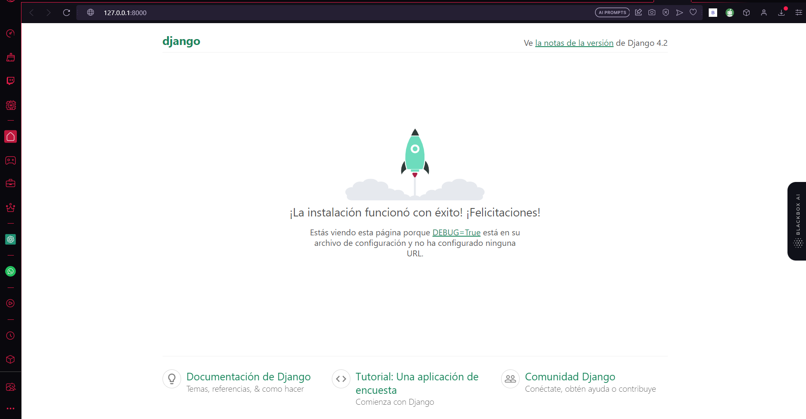

- Se crea una aplicacion en el proyecto y se utiliza HttpResponse

```
django-admin startapp calc
```

- Se crea una aplicacion en el proyecto

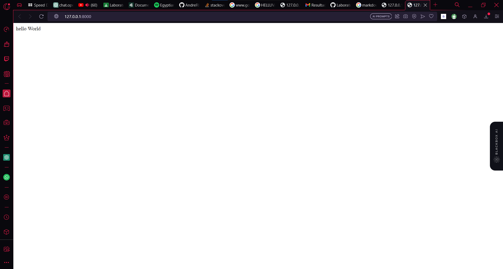

- Se modifica el archivo settings del proyecto para renderizar una pagina desde una carpeta templates

  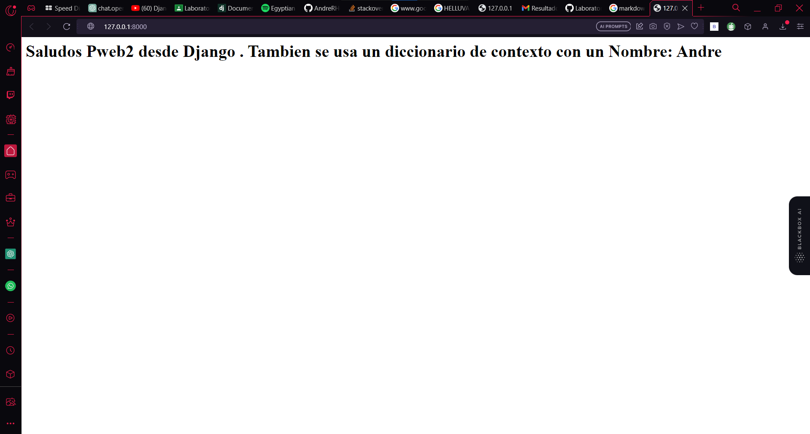

- Se Creo un nuevo archivo html llamado base, de donde todas las demas paginas heredaran caracteristicas

  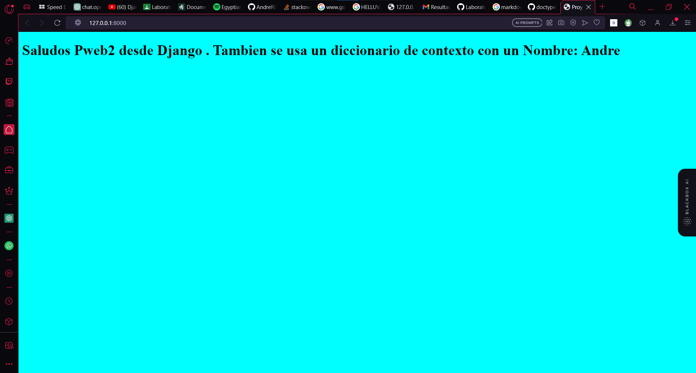

- Se establecio una nueva conexion con otra pagina derivada de base, ademas se incluyo un forms en la pagina principal, para agregarle una funcionalidad. Se aprendió acerca de como trabajar con valores obtenidos de un forms.

  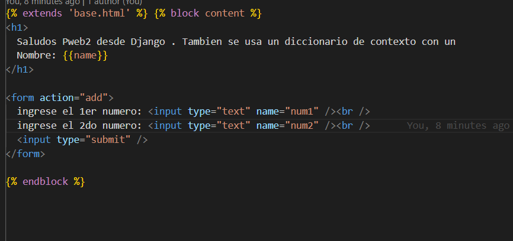

  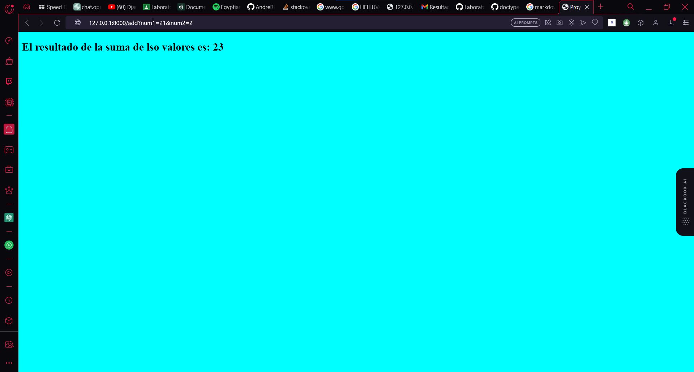

- Se aprendió la diferencia entre los metodos GET Y POST para el uso de la aplicación Web,

  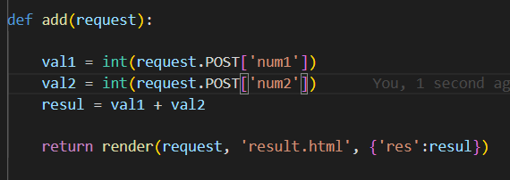

- Se creo una pagina web a base de una plantilla de Travello, se creo una aplicacion homonima y se configuro para que las dependencias como hojas de estilos, javascript o imagenes esten disponibles

  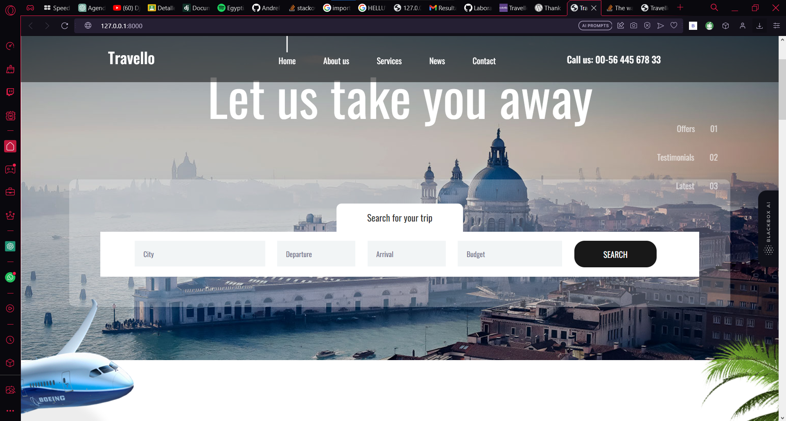

- En la pagina web anteriormente creada, se implemento la forma de trabajar con objetos dinamicos, aqui se trabajo con modulos para crear una clase con atributos como nombre, precio ,descripcion y una imagen. Seguidamente se trabajo con una sintaxis para generar un loop, asi se puede obviar procesos repetitivos.

  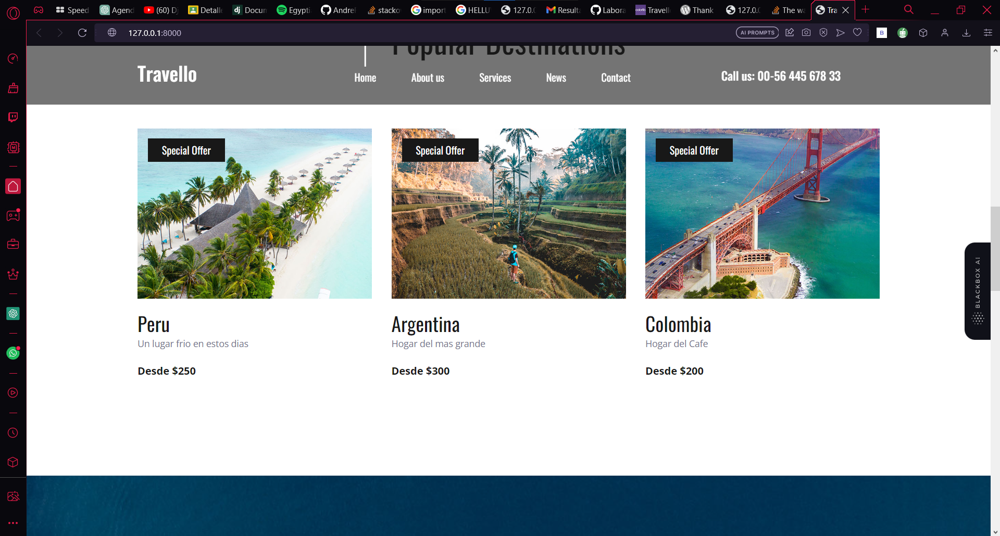

- Se utilizaron los condicionales para tener un resultado unico siempre y cuando se cumpla la condicion, en este caso un booleano.

  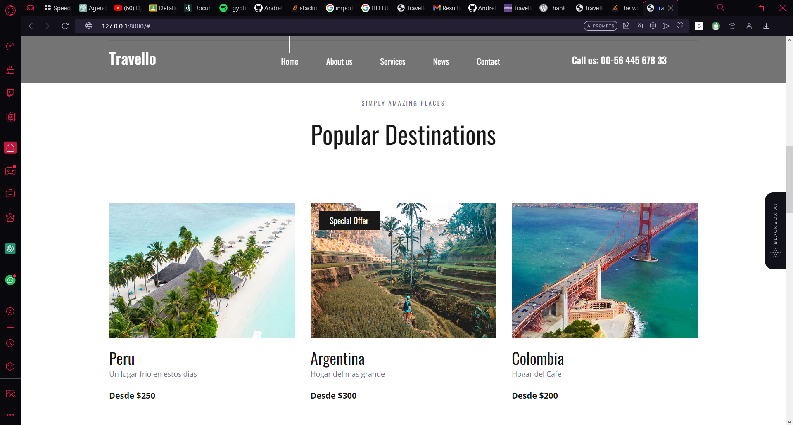

- Se instalo postgres sql y se creo una tabla tambien aplicando migraciones
  
  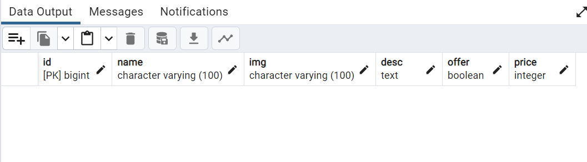


  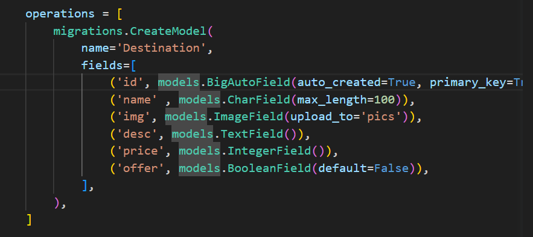

- Se creo de forma dinamica una forma de añadir lugares turisticos desde admin
  
  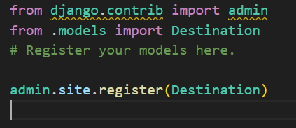


  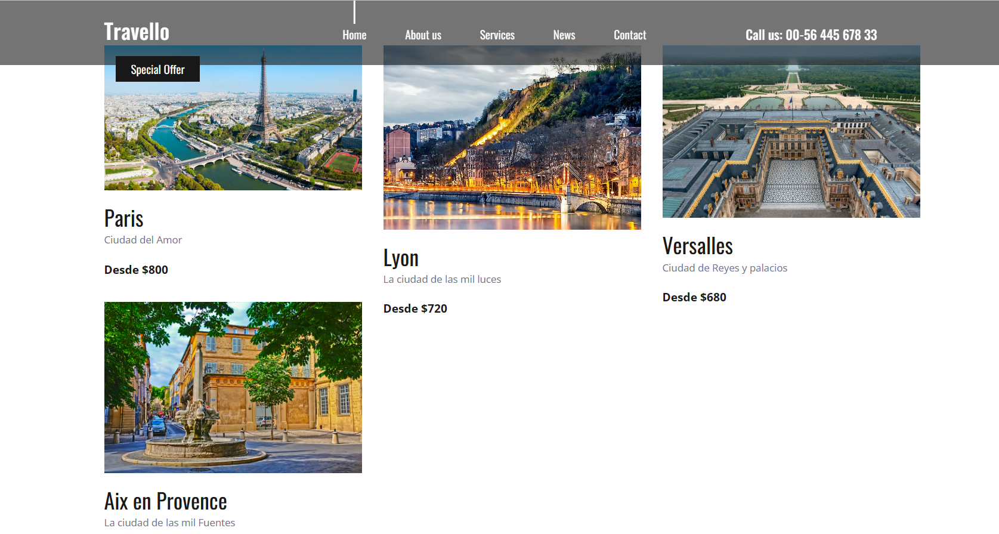

- Se creo un formulario para poder registrar usuario regulares y se enlazo con la base de datos 

  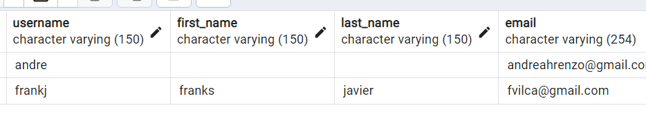


  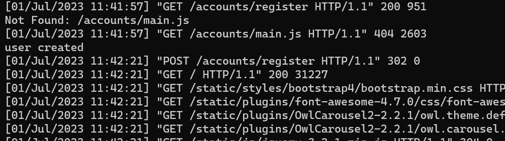

- Se modifico el registration para no permitir usuarios, emails y contraseñas incorrectos, ademas se utilizaron mensajes para comunicarse con la pagina web

  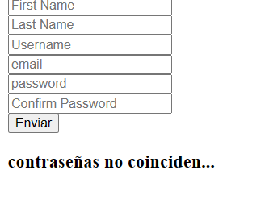


- Se creo la forma de confirmar si un usuario esta registrado, ademas se mejoro las direcciones de los formularios

  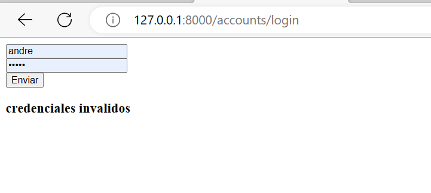


#

## Ejercicios Propuestos

1. Deberán replicar la actividad del video donde se obtiene una plantilla de
   una aplicación de Destinos turísticos y adecuarla a un proyecto en blanco
   Django.

2. Luego trabajar con un modelo de tabla Destinos Turisticos donde se
   guarden nombreCiudad, descripcion Ciudad, imagenCiudad, precioTour,
   ofertaTour (booleano). Estos destinos turísticos deberán ser agregados
   en una vista dinámica utilizando tags for e if.

3. Crear formularios de Añadir Destinos Turísticos, Modificar, Listar y Eliminar Destinos.
4. Eres libre de agregar CSS para decorar tu trabajo.

5. Ya sabes que el trabajo con Git es obligatorio. Revisa el avance de la
   teoría Django parte4

#

## REFERENCIAS

- https://www.w3schools.com/python/python_reference.asp
- https://docs.python.org/3/tutorial/

#

[license]: https://img.shields.io/github/license/rescobedoq/pw2?label=rescobedoq
[license-file]: https://github.com/rescobedoq/pw2/blob/main/LICENSE
[downloads]: https://img.shields.io/github/downloads/rescobedoq/pw2/total?label=Downloads
[releases]: https://github.com/rescobedoq/pw2/releases/
[last-commit]: https://img.shields.io/github/last-commit/rescobedoq/pw2?label=Last%20Commit
[Debian]: https://img.shields.io/badge/Debian-D70A53?style=for-the-badge&logo=debian&logoColor=white
[debian-site]: https://www.debian.org/index.es.html
[Git]: https://img.shields.io/badge/git-%23F05033.svg?style=for-the-badge&logo=git&logoColor=white
[git-site]: https://git-scm.com/
[GitHub]: https://img.shields.io/badge/github-%23121011.svg?style=for-the-badge&logo=github&logoColor=white
[github-site]: https://github.com/
[Vim]: https://img.shields.io/badge/VIM-%2311AB00.svg?style=for-the-badge&logo=vim&logoColor=white
[vim-site]: https://www.vim.org/
[Java]: https://img.shields.io/badge/java-%23ED8B00.svg?style=for-the-badge&logo=java&logoColor=white
[java-site]: https://docs.oracle.com/javase/tutorial/

[![Debian][Debian]][debian-site]
[![Git][Git]][git-site]
[![GitHub][GitHub]][github-site]
[![Vim][Vim]][vim-site]
[![Java][Java]][java-site]

[![License][license]][license-file]
[![Downloads][downloads]][releases]
[![Last Commit][last-commit]][releases]
